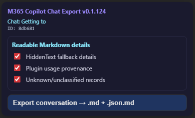

# M365 Copilot Chat Conversation Exporter — Userscript

Version: **v1.0.22**

Export the current Microsoft 365 Copilot Chat conversation to readable Markdown and raw JSON Markdown files.

## What it does

This userscript adds a small exporter panel to Microsoft 365 Copilot Chat pages. From an open conversation, it can export:

1. a readable Markdown file (`.md`) for review, search, and handoff;
2. a raw JSON Markdown companion (`.json.md`) as the complete local backup.

The readable Markdown is designed to be compact and useful to humans. The raw JSON companion is the most complete record and should be kept with the Markdown export.

## Screenshot



## Install

Install from GreasyFork:

```text
https://greasyfork.org/en/scripts/577806-m365-copilot-chat-conversation-exporter
```

Manual installation is also possible from the public GitHub userscript file:

```text
m365-copilot-export.js
```

Use a userscript manager such as Tampermonkey or Violentmonkey and import the raw userscript file.

## Supported pages

The userscript targets Microsoft 365 Copilot Chat web conversations, including common Microsoft 365 chat URL variants such as:

```text
https://m365.cloud.microsoft/chat*
https://m365.cloud.microsoft/*/chat*
https://microsoft365.com/chat*
https://www.microsoft365.com/chat*
```

It is intended for Microsoft 365 work or school Copilot Chat sessions, not personal Copilot chats.

## Usage

1. Open a Microsoft 365 Copilot Chat conversation in the browser.
2. Wait for the exporter panel to detect the current chat.
3. Choose whether to include unclassified records.
4. Click the export button.
5. Keep the generated `.md` and `.json.md` files together.

## Export contents

Readable Markdown may include:

- user prompts and Copilot responses;
- uploaded filenames when detected;
- reasoning/process summaries where available;
- tool-run/code execution details;
- search/source provenance;
- citations and links;
- selected plugin/tool provenance when useful for understanding the conversation.

Raw JSON Markdown includes the full conversation JSON payload wrapped in a Markdown file for easier storage and opening.

## Source and support

Source:

```text
https://github.com/site-speed/M365-Copilot-Chat-Export-userscript
```

Issues:

```text
https://github.com/site-speed/M365-Copilot-Chat-Export-userscript/issues
```

## Privacy and data handling

Exports are generated from your authenticated browser session and may contain sensitive organisation data, prompts, responses, citations, file names, and tool traces.

Treat exported `.md` and `.json.md` files as private unless reviewed and deliberately shared.

## Limitations

- Microsoft 365 Copilot Chat APIs and page structure can change.
- The readable Markdown export is curated for usefulness, not a byte-for-byte mirror of every JSON field.
- The raw JSON companion is the best fallback if a future renderer misses a detail.

## Release notes

Current release notes are available at:

```text
assets/release-notes.md
```

## Security

See `SECURITY.md` for supported-version and reporting guidance.

## Acknowledgements

Thanks to the following MIT-licensed userscript projects and authors that helped inform this work:

- [ingo/m365-copilot-chat-exporter](https://github.com/ingo/m365-copilot-chat-exporter) by Ingo Muschenetz.
- [ganyuke/copilot-exporter](https://github.com/ganyuke/copilot-exporter) by ganyuke.
- [NoahTheGinger/Userscripts](https://github.com/NoahTheGinger/Userscripts) by NoahTheGinger.

This project is MIT licensed.

## Licence

MIT License. Copyright 2026 Tim Moss.
